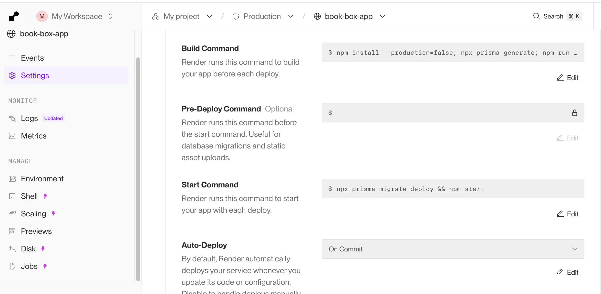
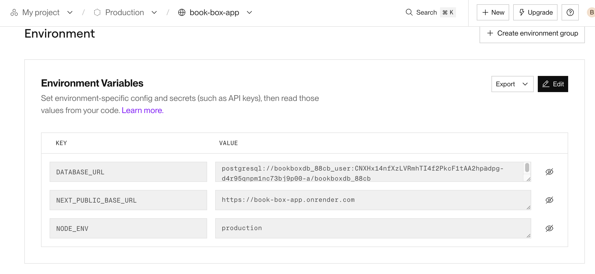

# Déployer sur Render.com

Voici les étapes pour déployer votre application Next.js sur Render.com.

## 1. Étapes pour la base de données :
1.  Créez un compte sur [Render.com](https://render.com/).
2.  Cliquez sur **"New +"** et sélectionnez **"PostgreSQL"**.
3.  Donnez un nom (ex: `book-box-db`).
4.  Choisissez le plan **"Free"**.
5.  Une fois créée, copiez l'**Internal Database URL** (pour le déploiement) et l'**External Database URL** (si vous souhaitez y accéder depuis votre ordinateur).


## 2. Configuration du Service Web sur Render

1.  Sur le dashboard Render, cliquez sur **"New +"** -> **"Web Service"**.
2.  Connectez votre dépôt GitHub/GitLab.
3.  **Name** : `my-book-box-app` (ou autre).
4.  **Runtime** : `Node`.
5.  **Build Command** :
    ```bash
    npm install --production=false && npx prisma generate && npm run build
    ```
    *Note : `--production=false` est nécessaire pour installer les types TypeScript (`devDependencies`) pendant le build, même si `NODE_ENV` est sur `production`.*
6.  **Start Command** :
    ```bash
    npm start
    ```
    *Optionnel : Pour appliquer les migrations automatiquement au démarrage, utilisez :*
    ```bash
    npx prisma migrate deploy && npm start
    ```
    


## 3. Variables d'Environnement

Dans la configuration du Web Service sur Render, allez dans l'onglet **"Environment"** et ajoutez :

*   **Key** : `DATABASE_URL`
*   **Value** : (Collez l'**Internal Database URL** de votre base PostgreSQL créée à l'étape 1).
*   **Key** : `NODE_ENV`
*   **Value** : `production`


Exemple :



## 4. Migration des Données

Lors du premier déploiement, la base de données sera vide. La commande `npx prisma migrate deploy` dans le *Start Command* se chargera de créer les tables.

Si vous avez besoin de données initiales (comme vos "sponsored books" s'ils sont en DB, ou des catégories), vous devrez peut-être exécuter un script de "seed" ou les ajouter manuellement.
